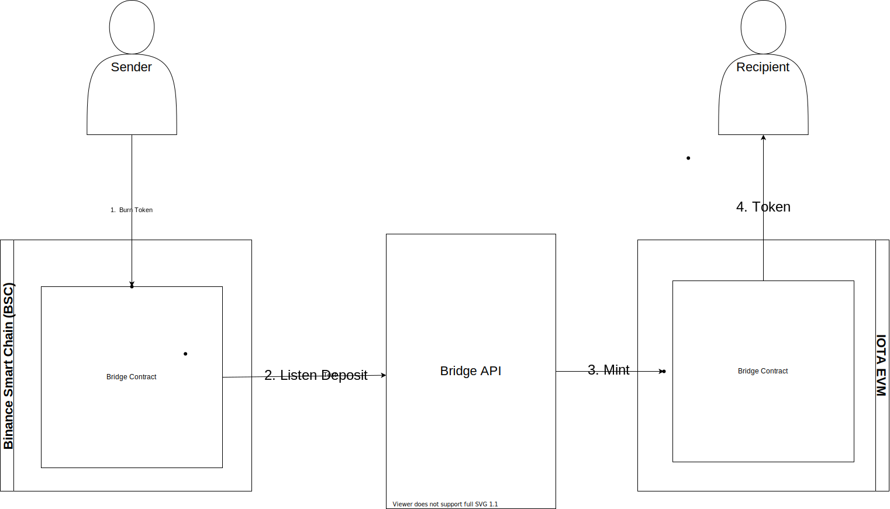

# Decentralized Bridges



## Binance Smart Chain (BSC) Testnet
```bash
Token deployed to: 0x48c560295504826f94CA0dfE120D4b540148D9b0
Bridge deployed to: 0x18076eee61806762750E8B5c20678EB4B05D695A
```

## IOTA EVM Testnet
```bash
Token deployed to: 0xA736a3785a4554a55b57CAddf1C3973fd2CF9f11
Bridge deployed to: 0x895Fbe1BFBBC52EdD6948D153180cAbD71945F37
```

## iota-defi.com
```bash
Token deployed to: 0xC40af1448fB9DbEEA037Ecd07db51106931e0BBB
Bridge deployed to: 0x27A23dC5fB4dD1A8D88fCff93d93e7E585c1d9fD
```

## Manual Deployment

0) Setup the project
```bash
npm install
```

1) Deploy the bridges in both networks:

iota-defi.com

```bash
npx hardhat run --network iotadefi scripts/deploy-iota-defi.ts
```

IOTA EVM Testnet
```bash
npx hardhat run --network iscp scripts/deploy-iota.ts
```

2) Start the Bridge API 

IOTA EVM Testnet
```bash
npx hardhat run --network iscp scripts/deploy-iota.ts
```

3) Test it!

Send ERC20 Tokens from iota-defi.com EVM to IOTA EVM Public Testnet (Helper script, in normal case, you will use metamask and a web3 app)
```bash
npx hardhat run --network iotadefi scripts/transfer-iotadefi-to-iotaEvm.ts
```

